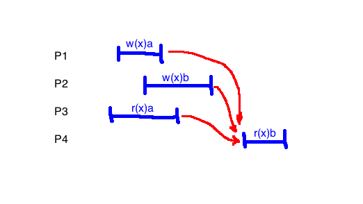
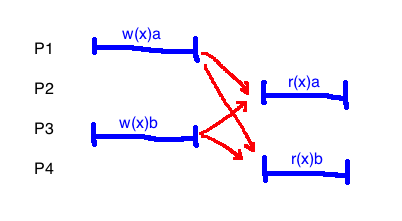

# Consistency and Replication

Distribution:
1. Partitioning
2. Replication

## Replication
Why?
- increase throughput
  - e.g. Memcache, having multiple copies allows more things being served at once
- Lower latency
  - Adds more hardware to the problem
- Greater fault tolerance

## Examples
1. GFS and HDFS
  - Data storage and movement
2. Map-reduce
  - Math (speculative execution)
3. MySQL server
  - Data (shared mutable state)
  - Very hard

## Storage system behaviour
### Sequential Consistency

This example is consistent:

Process|time| | | | |
-------|----|-|-|-|-|
P1|w(x)a| | | |
P2| |w(x)b| | |
P3| | |r(x)b| |r(x)a
P4| | | |r(x)b|r(x)a

If two writes occur in two different processes, they do not necessarily fall in temporal order. This only applies to writes in the same process.

There must be a sequential ordering of the events for it to be sequentially consistent.

This example is **not**:

Process|time| | | | | |
-------|----|-|-|-|-|-|
P1|w(x)a| | | | |
P2| |w(x)b| | | |
P3| | |r(x)b| |r(x)a|
P4| | | |r(x)a| |r(x)b

### Causal consistency
Process|time| | | | | |
-------|----|-|-|-|-|-
P1|w(x)a|     |     |w(x)c|     |
P2|     |r(x)a|w(x)b|     |     |
P3|     |r(x)a|     |     |r(x)c|r(x)b
P4|     |r(x)a|     |     |r(x)b|r(x)c

Has relationships "follows in program order" and "reads from", both examples of a causal precedence. This is causally consistent.

This is not:

Process|time| | | | |
-------|----|-|-|-|-|
P1|w(x)a|     |     |     |
P2|     |r(x)a|w(x)b|     |
P3|     |     |     |r(x)b|r(x)a
P4|     |     |     |r(x)a|r(x)b

However, removing a read makes it consistent again:

Process|time| | | | |
-------|----|-|-|-|-|
P1|w(x)a|     |     |     |
P2|     |     |w(x)b|     |
P3|     |     |     |r(x)b|r(x)a
P4|     |     |     |r(x)a|r(x)b

### Linearizability

Arrows represent the **happens before** relation.
- $a$ happens before $b$ if $a.end \lt b.start$
- Implicitly, each read happens after the most recent write

Potential orderings:
- O1: P2.w(x)b, P4.r(x)b, P2.w(x)a, P3.r(x)a
  - Not ok since P1.w(x)a happens after P4.r(x)b
- O2: P1.w(x)a, P3.r(x)a, P2.w(x)b, P4.r(x)b
  - ok: all read values make sense, no backwards arrows

Since there is a valid total order, the example is linearizable.

Alternative interpretation
- Place a dot representing a single instant where the event happens, where the dot has to be between the start and end of the operation
- Connect dots so that you never go backwards and read values make sense
- If this is possible, it is linearizable

This example is not linearizable:

- Any way that we find a total order, both writes must come before both reads
- It is not possible to do this and have the reads make sense

Linearizability check algorithm
- Make a graph where the vertices are each operation
- Add an edge $(a, b)$ if:
  - $a.end \lt b.start$
  - there is a read after $b$ that reads the value $b$ wrote, and $a$ wrote a different value
- If there is a cycle in this graph, it is not linearizable

Another:
- Make a graph where the vertices are the values of the thing being read/written to
- Add an edge from $a, b$ if there is a write of $b$ after a read of $a$
- Check for cycles

### Eventual consistency
- If no updates take place for a long time, all replicas will gradually become consistent.
- In the absence of new writes from clients, all servers will eventually hold the same data.

This allows different processes to observe write operations taking effect in different orders, even when these write operations are related by "causally precedes" or "happens before"

e.g. This **does not** have eventual consistency
1. P1.w(x)a
2. P2.w(x)b
3. P3.r(x)a
4. P4.r(x)b
5. Repeat steps 3 and 4 forever.

### Properties
- There are all examples of **safety properties**
- Sequential consistency is a subset of causal consistency (it is a stronger definition)
- Linearizability is a subset of sequential consistency
- linearizable $\Rightarrow$ sequentially consistent $\Rightarrow$ causally consistent

#### Guarantees: Monotonicity
Every time you do a read, it should either be the same value as before, or a newer version

Negative example:

Process|time| | |
-------|----|-|-
P1|w(x)a|     |
P2|w(x)b|     |
P3|     |r(x)a|r(x)b
P4|     |r(x)b|r(x)a

Positive example:

Process|time| | | | |
-------|----|-|-|-|-
P1|w(x)a|     | | |
P2|w(x)b|     | | |
P3|     |r(x)a|r(x)b| |
P4|     |     |     |r(x)b|r(x)a

#### Guarantees: Read your own writes
If you write a value and then do a read, you should get the value you just wrote, not an older one

## Protocols
### Primary backup
A server has the true copy

### Quorum
There is a maximum number of servers $f$ that are allowed to fail, and a value is considered written after a majority have written.

Let $N$, $N_R$, and $N_W$ be total number of replicas for a data object $x$, the size of the read quorum, and the size of the write quorum.

In distributed databases, RW quorums must satisfy:
1. $N_R + N_W \gt N$ (read and write quorums overlap)
2. $N_W + N_W \gt N$ (two write quorums overlap)

#### Partial quorums
Partial quorums lack overlap

1. $N_R + N_W \gt N$ (strong consistency)
2. $N_R + N_W \le N$ (weak consistency)

Use last-timestamp-wins to deal with conflicts

## Fault Tolerance

Dependability
- Availability (e.g. 99.99...%)
- Reliability
- Safety
- Maintainability

Fault types
- Transient: goes away on its own
- Intermittent: fault that happens only some of the time, often related to electrical contacts
- Permanent: much easier to diagnose

Masking failures
- Have redundant, identical processes
  - Arranged in a flat group: all have equal weight
  - Arranged hierarchically: has a leader/coordinator
- How many backups?
  - If you need to tolerate $f$ failures, you need at least $2f+1$ processes to be able to have a majority
  - If you have primary backups, you need $f+1$, but with the assumption that you will fix the broken ones soon

### Consensus Problem
- Has interfaces `propose(x)`, `decide()`
- Each process calls `propose()` at most once, and `decide()` at most once
- Safety properties
  - Agreement: two calls to `decide()` never return different values
  - Validity: If `decide()` returns `v`, then some process called `propose(v)`
- Liveness/Termination policy: calls to `propose(x)` and `decide()` eventually terminate
