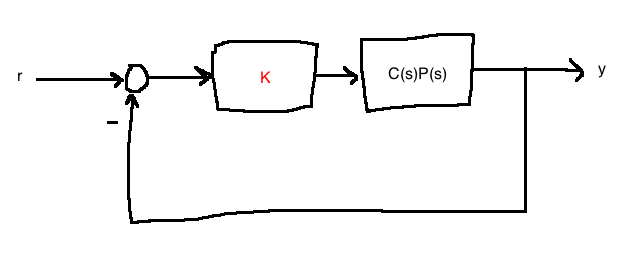
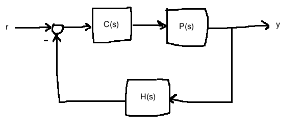
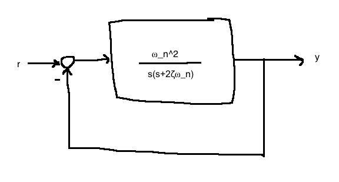
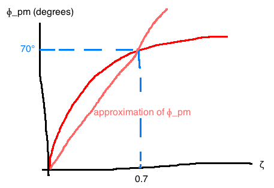
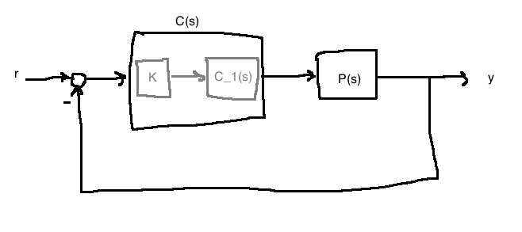
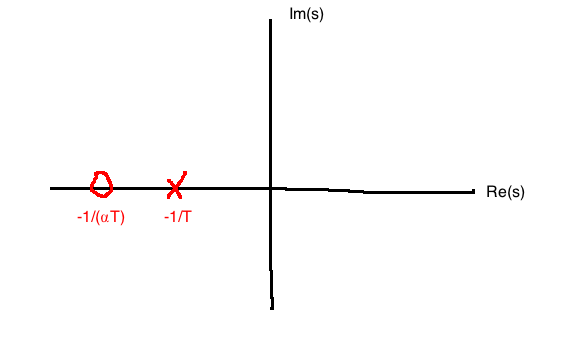
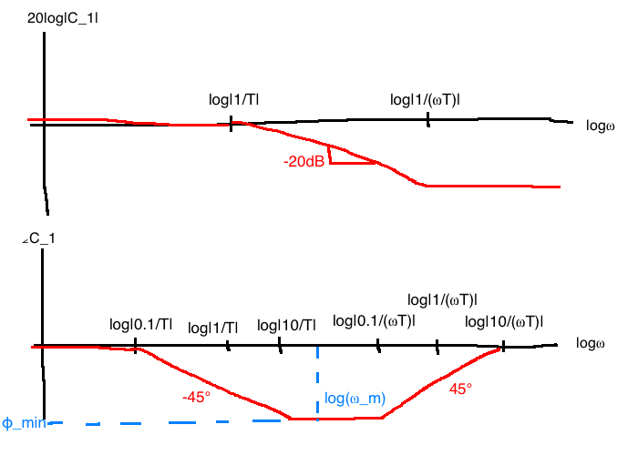
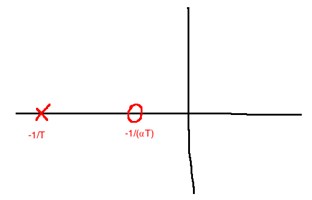
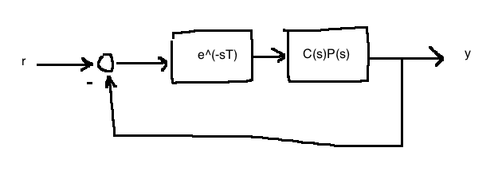

# Intro to Control Design in the Frequency Domain

- This chapter is about "classical" Frequency domain design
- Specs will be given in terms of **bandwidth** and **stability margins**
- Our real interest is in how the system behaves in the time domain, so we will use the duality between these domains
- We'll take specs like %OS, $T_s$, steady-state tracking error and convert them to the frequency domain

## Intro to stability margins
If a system is stable, how stable is it? This depends on how much error/uncertainty there is in the plant model. Stability margins help answer the question of how much inaccuracy the system can handle. Best understoodusing **Nyquist plots**, but Bode plots work too

### Gain margin


- Think of $K=1$ as our **nominal design**
- Our **gain margin** $K_{gm} = \max\left\{\bar{K} \gt 1: \text{ closed-loop stability for } K \in [1, \bar{K})\right\}$

### Phase margin

- Think of $\phi=0$ as out **nominal design**
- Our **phase margin** $\Phi_{pm} = \max\left\{\bar{\phi} \gt 0: \text{ closed-loop stability for } \phi \in [1, \bar{\phi})\right\}$

- Large $K_{gm}, \phi_{pm}$ not only ensure robustness, but also good transient behaviour. A system with small $K_{gm}, \Phi_{pm}$ is nearly unstable which could mean slow response and oscillatory behaviour.

### Obtaining gain and phase margins


Let $L(s) := C(s)P(s)H(s)$. Draw the Bode plot of $L(j\omega)$.


- $\omega_{gc}$ is the gain crossover frequency
  - frequency at which $L(j\omega_{gc})=1$
  - frequency at which we measure $\Phi_{pm}$
- $\omega_{pc}$ is the phase crossover frequency
  - frequency at which $\angle L(j\omega_{pc})=\pi$
  - frequency at which we measure $K_{gm}$

Matlab:
```matlab
[K_gm, Phi_pm, omega_pc, omega_gc] = margin(sys);
```

## Performance Specifications
We focus on:
1. input-output stability
2. steady-state tracking error
3. %OS (converted into a $\Phi_{pm}$ spec)
4. Closed-loop bandwidth

### Relationship between crossover frequencies and bandwidth
$$\frac{Y(s)}{R(s)} = \frac{C(s)P(s)}{1+C(s)P(s)} = G(s)$$


Define the loop transfer function:
$$L(s) = C(s)P(s)$$
We can see the open-loop gain crossover frequency:


"Normally," $\omega_{gc} \lt \omega_{bw} \lt \omega_{pc}$. For design purposes, we'll use a rule of thumb:
$$\omega_{gc} \approx \omega_{bw}$$

### Relationship between damping ratio and phase margin
Damping ratio: $\zeta$
Phase margin: $\Phi_{pm}$

This relationship can be found in closed form for second-order systems.



$$\frac{Y(s)}{R(s)} = \frac{\omega_n^2}{s^2+2\zeta\omega_ns + \omega_n^2}$$

A messy calculation gives:
$$\Phi_{pm}=\tan^{-1}\left(2\zeta\left((1+4\zeta^4)^{\frac{1}{2}}-2\zeta^2\right)^{\frac{-1}{2}}\right)$$



## Lag Compensation


Lag controller:
$$\begin{align}
C(s) &= KC_1(s)\\
&= K\frac{\alpha Ts+1}{Ts+1}, \quad 0 \lt \alpha \lt 1, \quad T \gt 0, \quad K \gt 0
\end{align}$$

Pole and zero locations for a lag controller:


### Steady-state gain
$$C(0)=K$$


Key befefit: Reduce high frequency gain without changing phase

### Uses
1. Boost low frequency gain to get good tracking and disturbance rejection without affecting stability margins or the high frequency behaviour ($e_{ss}$ spec and %OS spec)
2. To increase phase margin, done indirectly through changing the high frequency gain (See fig. 9.9 in the notes)

### e.g. 9.3.1
$$\begin{align}
P(s) &= \frac{1}{s(s+2)}\\
\\
C(s) &= \text{lag controller}\\
&= K\frac{\alpha Ts+1}{Ts+1}
\end{align}$$

Specs:
1. If $r(t)=t1(t)$, then $|e_{ss}| \le 0.05$.
2. $\Phi_{pm}^{desired} = 45^{\circ}$ (for good damping)

Steps 1: Choose $K$ to meet $e_{ss}$ spec. For now, assume $C(s)$ provides IO stability s we can apply FVT.
$$\begin{align}
e_{ss} &= \lim_{t\rightarrow \infty}e(t)\\
&= \lim_{s \rightarrow 0} sE(s)\\
&= \lim_{s \rightarrow 0} s\frac{1}{1+C(s)P(s)} R(s)\\
&= \lim_{s \rightarrow 0} s \frac{1}{1+\frac{K\alpha Ts+1}{Ts+1} \frac{1}{s(s_2)}} \frac{1}{s^2}\\
&= \frac{2}{K} \le 0.05 \Leftrightarrow K \ge 40
\end{align}$$
Take $K=40$

(Step 2) Next, draw a Bode plot of $KP(j\omega)=\frac{40}{s(s+2)}$. From the plot, we see that the phase margin $\Phi_{pm}=18^\circ$ (not to spec) at $\omega_{gc}=6.17$ rad/s.

Because it is not to spec, we design $C_1(s)=\frac{\alpha Ts+1}{Ts+1}$. We want $\Phi_{pm}^{desired}=45^\circ$, so we'll aim for $50^\circ$ since $\angle C_1(j\omega)$ only approaches zero asymptotically.

From out Bode plot in Step 2, we observe:
$$\Phi_{pm}^{desired} = 50^\circ = 180^\circ + \angle KP(j\omega) \text{ when } \omega=1.7\text{rad/s}$$
The idea is to reduce the gain at $\omega=1.7$ rad/s so that this becomes the gain crossover frequency and do so without changing the phase.

The gain of $KP(j\omega)$ at $\omega=1.7$ rad/s is 19dB, so we want to reduce by 19dB to make it the crossover frequency.
$$20log|\alpha|=-19\text{dB} \Leftrightarrow \alpha=\frac{1}{9}$$

Now pick $T$ so that $\angle C(j\omega)\approx 0$ at $\omega=1.7$rad/s.
$$\frac{10}{\alpha T} \le 1.7$$
We'll pick $T=52.7$ to get the final controller:
$$C(s)=40 \frac{\frac{1}{9} \cdot 52.7s+1}{52.7s=1}=\frac{234.2s+40}{52.7s+1}$$

We verify with a simulation. The Bode plot of $C(s)P(s)$ yields $\Phi_{pm}=44.6^\circ$.

### Procedure for lag design

Specs:
1. Steady-state tracking/disturbance rejection
2. $\Phi_{pm}^{desired}$ (may be given as an overshoot spec, so you need to convert)

Procedure:
1. Use Final Value Theorem to pick $K$ and meet spec 1.
2. Draw Bode plot of $KP(j\omega)$
3. If spec 2 is satisfied, stop. Otherwise, find $\omega$ such that $180^\circ + \angle KP(j\omega) = \Phi_{pm}^{desired} + \delta$, where $\delta$ is a buffer to account for $\angle C(j\omega) \ne 0$ at high $\omega$. Usually $5^\circ$.
4. Shift the gain of $KP$ down at $\omega$ so that $\omega$ becomes $\omega_{gc}$: $\alpha=\frac{1}{KP(j\omega)}$.
5. Put the controller zero far away from $\omega$ so that phase isn't affected too much: $\frac{10}{\alpha T} \le \omega$.
6. Simulate to verify (see PS9 for a root-locus based design)

## Lead controller


$$\begin{align}
C(s) &= KC_1(s)\\
&= K\frac{\alpha Ts+1}{Ts+1}, \quad \alpha \gt 1, \quad K,T \gt 0
\end{align}$$




Uses
1. Increase gain crossover frequency to increase closed loop bandwidth
2. Increase phase margin by adding phase where needed

### Lead design equations
$$\omega_m = \frac{1}{T\sqrt{\alpha}}$$
This is the frequency at which the lead controller adds max phase.

$$\phi_{max} = \sin^{-1}\left(\frac{\alpha-1}{\alpha+1}\right)$$
$$\alpha = \frac{1+\sin{\phi_{max}}}{1 - \sin{\phi_{max}}}$$
This is the max phase added by the lead controller.

### e.g. 9.4.1
$$P(s) = \frac{1}{s(s+2)}$$

Specs:
- $|e_{ss}| \le 0.05$ for $r(t)=t1(t)$
- $\Phi_{pm} = 45^\circ$

We want to explress the lead controller in the form:
$$C(s)=\frac{\hat{K}}{\sqrt{\alpha}} \frac{\alpha Ts+1}{Ts+1}$$

First, choose $\hat{K}$ to meet the steady-state spec using FVT. In this case, we get $\hat{K} \ge 40$. We then want to boost $\hat{K}$ by around 10dB to account for effective $\alpha$. Our final result is $\hat{K}=40\cdot \sqrt{10}$.

Next, draw a Bode plot of $\hat{K}P(j\omega)$ and observe that we have $\Phi_{pm}=10.2^\circ$ at $\omega_{gc}=11.2$ rad/s. So we set $\omega_m = \omega_{gc}$. We need to add $\Phi_{pm}^{desired} - \Phi_{pm} = 45-10.2 = 34.8^\circ$. Therefore, set $\phi_{max} = 34.8^\circ$. This gives us $\alpha=3.66$.

(This also gives $K=\frac{\hat{K}}{\sqrt{\alpha}}=66.13$.)

Then, make sure we add $\phi_{max}$ at the correct frequency.
$$T=\frac{1}{\omega_m\sqrt{\alpha}}=0.0467$$

Combining these:
$$C(s)=66.13 \frac{3.66\cdot 0.0467s+1}{0.0467s+1} = \frac{241.9(s+5.85)}{s+21.43}$$

Finally, verify design. Draw the Bode plot of $C(s)P(s)$ yields $\Phi_{pm}=45^\circ$, $\omega_{gc}=11.1$ rad/s.

### Procedure for lead design

Specs:
1. $\Phi_{pm}^{desired}$
2. Either:
  - steady-state tracking/disturbance rejection
  - desired closed-loop bandwidth

Procedure:
1. Let $\hat{K}=K\sqrt{\alpha}$ and choose $\hat{K}$ so that either:
  - Using FVT, pick $\hat{K}$ $\hat{K}P$ meets steady-state spec. From here, we purposefully boost $\hat{K}$ by 10dB to account for $\alpha$ distortion
  - Pick $\hat{K}$ so that $\hat{K}P$ has desired gain crossover frequency ($\omega_{gc} = \omega_{BW}$)
2. Draw Bode plot of $\hat KP$
3. Find $\omega_{gc}$ and $\Phi_{pm}$. Set $\omega_m = \omega_{gc}$.
4. Determine the amount of phase to add: set $\phi_{max}=\Phi_{pm}^{desired} - \Phi_{pm}$.
5. $\alpha = \frac{1+\sin\phi_{max}}{1-\sin\phi_{max}}$. (Determine the value of $K=\frac{\hat K}{\sqrt{\alpha}}$.)
6. Set $T = \frac{1}{\omega_m \sqrt{\alpha}}$
7. Simulate to check design

### E.g.

$$P(s)=\frac{10}{s^2-10}$$
Specs:
- $\Phi_{pm}=50^\circ$
- closed-loop bandwidth $\omega_{BW}=10$ rad/s


1. pick $\hat K$ so that $\omega_{gc}=\omega_{BW}$. From the plot,  we see that we need to boost the gain of $P$ by 20dB. i.e.: $20\log\hat K = 20 \Leftrightarrow \hat K = 10$.
2. Draw a Bode plot of $\hat K D$. (Or don't if it's an exam and you know how it'll change.)
3. $\omega_{gc} = 10$ rad/s, $\Phi_{pm} = 0$.
4. We need to add $\phi_{max}=\Phi_{pm}^{desired} - \Phi_{pm} = 50^\circ$.
5. $\alpha = \frac{1+\sin\phi_{max}}{1-\sin\phi_{max}} = 7.55^\circ$. This means $K=\frac{\hat K}{\sqrt \alpha} = 3.64$.
6. Add phase at the right drequency: $T = \frac{1}{\omega_m \sqrt \alpha}=0.0364$.

We get:
$$C(s)=3.64\frac{7.55\cdot 0.0364s+1}{0.0364s+1} = \frac{27.4 (s+3.65)}{s+27.47}$$

In this case, the closed-loop bandwidth ends up being 11.5 rad/s, so our approximation $\omega_{gc} \approx \omega_{BW}$ worked well.

### Delay tolerance
How much delay can we tolerate in our system before losing stability?


This diagram has the transfer function $T(s) = e^{-sT}$.

Bode plot of the delay: $\left|e^{-j\omega T}\right|=1$, $\angle e^{-j\omega T}=-\omega T$. The time delay **only affects phase**.




- Suppose that when $T=0$, the system has a phase margin of $\Phi_{pm}$ degrees at the frequency $\omega_{gc}$.
- The system will become unstable if we reduce the phase by $-\Phi_{pm}$ at $\omega=\omega_{gc}$.
- The maximum delay we can tolerate before losing stability is when $\angle e^{-j\omega_{gc}T_{max}} = -\Phi_{pm}$
  - i.e., $-\omega_{gc}T_{max} = -\Phi_{pm} \Leftrightarrow T_{max} = \frac{\Phi_{pm}}{\omega_{gc}}$
- Stability if $T \lt T_{max}$
