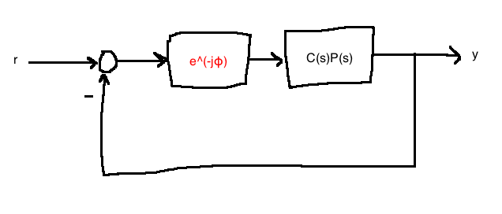

# Intro to Control Design in the Frequency Domaiin

- This chapter is about "classical" Frequency domain design
- Specs will be given in terms of **bandwidth** and **stability margins**
- Our real interest is in how the system behaves in the time domain, so we will use the duality between these domains
- We'll take specs like %OS, $T_s$, steady-state tracking error and convert them to the frequency domain

## Intro to stability margins
If a system is stable, how stable is it? This depends on how much error/uncertainty there is in the plant model. Stability margins help answer the question of how much inaccuracy the system can handle. Best understoodusing **Nyquist plots**, but Bode plots work too

### Gain margin


- Think of $K=1$ as our **nominal design**
- Our **gain margin** $K_{gm} = \max\left\{\bar{K} \gt 1: \text{ closed-loop stability for } K \in [1, \bar{K})\right\}$

### Phase margin

- Think of $\phi=0$ as out **nominal design**
- Our **phase margin** $\Phi_{pm} = \max\left\{\bar{\phi} \gt 0: \text{ closed-loop stability for } \phi \in [1, \bar{\phi})\right\}$

- Large $K_{gm}, \phi_{pm}$ not only ensure robustness, but also good transient behaviour. A system with small $K_{gm}, \Phi_{pm}$ is nearly unstable which could mean slow response and oscillatory behaviour.

### Obtaining gain and phase margins


Let $L(s) := C(s)P(s)H(s)$. Draw the Bode plot of $L(j\omega)$.


- $\omega_{gc}$ is the gain crossover frequency
  - frequency at which $L(j\omega_{gc})=1$
  - frequency at which we measure $\Phi_{pm}$
- $\omega_{pc}$ is the phase crossover frequency
  - frequency at which $\angle L(j\omega_{pc})=\pi$
  - frequency at which we measure $K_{gm}$

Matlab:
```matlab
[K_gm, Phi_pm, omega_pc, omega_gc] = margin(sys);
```
