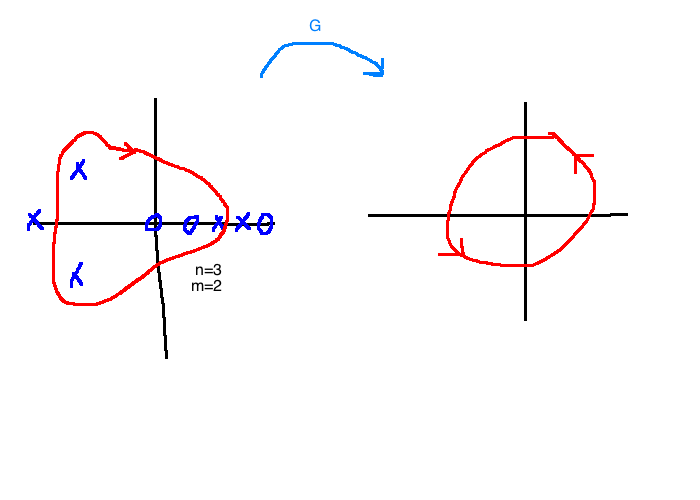

# Frequency Domain Methods for Stability Analysis

## 8.1 Cauchy's Principle of the Argument
Consider a closed curve in the $s$-plane with no self-intersections and with negative (clockwise) orientation.

Now let $G(s) \in \mathbb{R}(s)$. For each $s \in \mathbb{C}$, $G(s)$ is another complex number, so $G: \mathbb{C} \rightarrow \mathbb{C}$

If $\Gamma_s$ doesn't pass through any poles of $G$, then as $s$ makes a circuit around $\Gamma_s$, $G(s)$ traces out a different closed curve that we'll call $\Gamma_G$.

### e.g. 8.1.1
$$G(s) = s-1$$

Since $\Gamma_s$ encircles a zero of $G$, the angle of $G$ will change by $-2\pi$ as $s$ makes a circuit around $\Gamma_s$.

### e.g. 8.1.2
$$G(s) = s-1$$

Now the net change in $\angle G(s)= \angle(s-1)$ as $s$ moves around $\Gamma_s$ is zero. This means that $\Gamma_G$ does not encircle the origin.

### e.g. 8.1.3
$$G(s) = \frac{1}{s-1}$$

$\angle(s-a) = -\angle G$ because the pole is in the denominator.

Now, $\angle (s-1)$ changes by $-(-2\pi)=2\pi$ as the point makes a circuit aorund $\Gamma_s$. Therefore, $\Gamma_G$ must have a net angular change of $2\pi$ as $s$ moves around $\Gamma_s$. $\Gamma_G$ must encircle the origin once.

### Theorem
Suppose $G(s) \in \mathbb{R}(s)$ has no poles or zeroes on $\Gamma_s$, but $\Gamma_s$ encircles $n$ poles of $G$ and $m$ zeroes of $G$. Then, $\Gamma_g$ has $n-m$ counter-clockwise encirclements of the origin.

#### Proof
Write $G$ like so:
$$G(s) = K \frac{\prod_i (s-z_i)}{\prod_i (s - p_i)}$$
$K$ is a real gain, $z_i$ are zeroes, and $p_i$ are poles. Then, for each $s$ on $\Gamma_s$:
$$\angle G(s) = \angle K + \sum \angle(s-z_i) - \sum \angle (s-p_i)$$

If the zero $z_i$ is enclosed by $\Gamma_s$, the net change in the term $\angle(s-z_i)$ after one circuit around $\Gamma_s$ is $-2\pi$. If $z_i$ isn't enclosed, the net change is zero.

So, the net change in $\angle G$ is $m(-2\pi) - n(-2\pi) = (n-m)2\pi$.

$\Gamma_G$ must encircle the origin $n-m$ times in the counterclockwise direction.

