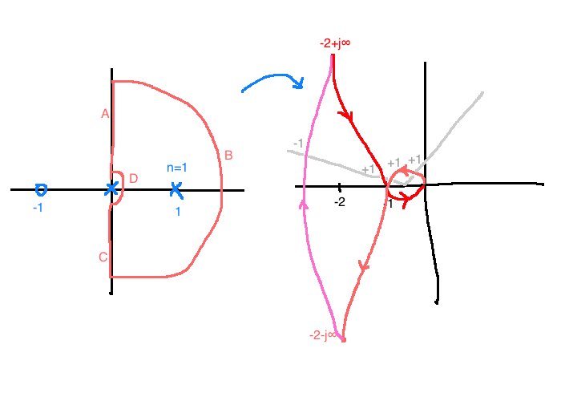

# Frequency Domain Methods for Stability Analysis

## 8.1 Cauchy's Principle of the Argument
Consider a closed curve in the $s$-plane with no self-intersections and with negative (clockwise) orientation.

Now let $G(s) \in \mathbb{R}(s)$. For each $s \in \mathbb{C}$, $G(s)$ is another complex number, so $G: \mathbb{C} \rightarrow \mathbb{C}$

If $\Gamma_s$ doesn't pass through any poles of $G$, then as $s$ makes a circuit around $\Gamma_s$, $G(s)$ traces out a different closed curve that we'll call $\Gamma_G$.

### e.g. 8.1.1
$$G(s) = s-1$$

Since $\Gamma_s$ encircles a zero of $G$, the angle of $G$ will change by $-2\pi$ as $s$ makes a circuit around $\Gamma_s$.

### e.g. 8.1.2
$$G(s) = s-1$$

Now the net change in $\angle G(s)= \angle(s-1)$ as $s$ moves around $\Gamma_s$ is zero. This means that $\Gamma_G$ does not encircle the origin.

### e.g. 8.1.3
$$G(s) = \frac{1}{s-1}$$

$\angle(s-a) = -\angle G$ because the pole is in the denominator.

Now, $\angle (s-1)$ changes by $-(-2\pi)=2\pi$ as the point makes a circuit aorund $\Gamma_s$. Therefore, $\Gamma_G$ must have a net angular change of $2\pi$ as $s$ moves around $\Gamma_s$. $\Gamma_G$ must encircle the origin once.

### Theorem
Suppose $G(s) \in \mathbb{R}(s)$ has no poles or zeroes on $\Gamma_s$, but $\Gamma_s$ encircles $n$ poles of $G$ and $m$ zeroes of $G$. Then, $\Gamma_g$ has $n-m$ counter-clockwise encirclements of the origin.

#### Proof
Write $G$ like so:
$$G(s) = K \frac{\prod_i (s-z_i)}{\prod_i (s - p_i)}$$
$K$ is a real gain, $z_i$ are zeroes, and $p_i$ are poles. Then, for each $s$ on $\Gamma_s$:
$$\angle G(s) = \angle K + \sum \angle(s-z_i) - \sum \angle (s-p_i)$$

If the zero $z_i$ is enclosed by $\Gamma_s$, the net change in the term $\angle(s-z_i)$ after one circuit around $\Gamma_s$ is $-2\pi$. If $z_i$ isn't enclosed, the net change is zero.

So, the net change in $\angle G$ is $m(-2\pi) - n(-2\pi) = (n-m)2\pi$.

$\Gamma_G$ must encircle the origin $n-m$ times in the counterclockwise direction.

## Nyquist Contour
Take $\Gamma_s$ to encircle the whole right-half plane

For this choice of $\Gamma_S$, the corresponding curve $\Gamma_G$ is called the **Nyquist plot** of $G$. If $G$ has no poles or zeroes **on** $\Gamma_s$$, then by the principle of the argument, the Nyquist plot will encircle the origin $n-m$ times in counterclockwise direction.

$n$ is the nulber of poles of $G$ with $\Re(s) \gt 0$, $m$ is the number of zeroes of $G$ with $\Re(s) \gt 0$.

If $G$ has poles on $j\mathbb{R}$, we'll indent around them.

## Nyquist stability criterion

Assuming $C,P$ are rational:
1. $P,C$ are proper, $CP$ strictly proper
2. No unstable pole-zero cancellations
3. $K \ne 0$

Key idea: if the system is IO stable, then the poles of $\frac{Y(s)}{R(s)} = \frac{KC(s)P(s)}{1+KC(s)P(s)}$ must all be in $\mathbb{C}^-$. So, we'll wirk with the transfer function $G(s)=1+KC(s)P(s)$.

### Theorem
Let $n$ denote the number of poles of $C(s)P(s)$ in $\mathbb{C}^-$. Construct the Nyquist plot of $C(s)P(s)$ indenting to the right around any poles on the imaginary axis. The feedback system is IO stable if and only if the Nyquist plot doesn't pass through $\frac{-1}{K}$ and encircles $\frac{-1}{K}$ exactly $n$ times counterclockwise.

### Proof
$$\frac{Y(s)}{R(s)} = \frac{KC(s)P(s)}{G(s)}$$
Since we've assumed no unstable pole-zero cancellations, IO stability is equivalent to $G(s)$ having no zeroes with $\Re(s) \ge 0$. (See Theorem 5.2.10.)

I.O. stability $\Leftrightarrow \frac{KC(s)P(s)}{G(s)}$ has no poles with $\Re(s) \ge 0 \Leftrightarrow G(s)$ has no **zeroes** with $\Re(s) \ge 0$.

Since $G(s)=1+K\frac{N_c(s)}{D_c(s)} \frac{N_p(s)}{D_p(s)} = \frac{D_cD_p+KN_cN_p}{D_cD_p}$, so $G$ has the same poles as $CP$. Therefore, $G$ has $n$ poles with $\Re(s) \gt 0$.

Since $\Gamma_s$ indents around poles on $j\mathbb{R}$ and since $G$ is proper, $\Gamma_s$ doesn't pass through any poles of $G$. By the principle of the argument, $\Gamma_G$ will encircle the origin $n-m$ times in the counterclockwise direction.

Since we need **no** zeroes with $\Re(s) \gt 0$, we need $m=0$ for stability. Since $C(s)P(s) = \frac{1}{K}G(s) - \frac{1}{K}$, the Nyquist plot of $CP$ is going to be the Nyquist plot of $G$ scaled (possibly by $K$) and then shifted to the left by $\frac{-1}{K}$.

Conclusion: IO stability exists if and only if the Nyquist plot of $CP$ encircles $\frac{-1}{K}$ $n$ times in the counterclockwise direction.

### Remarks

Since $C(s)P(s)$ is rational, we have:
- $|C(j\omega)P(j\omega)| = |C(-j\omega)P(-j\omega)|$
- $\angle C(j\omega)P(j\omega) = -\angle C(-j\omega)P(-j\omega)$
- So the image of $\Gamma_s$ along the negative imaginary axis is a reflection about the real axis of the positive imaginary axis
- We see that a Nyquist plot is (aside from indentations) a polar plot of $C(s)P(s)$. It's a plot of the curve $\omega \rightarrow C(j\omega)P(j\omega)$ as $\omega$ goes from 0 to $\infty$
- The Bode plot of $C(s)P(s)$ is just $20\log|C(j\omega)P(j\omega)|$ and $\angle C(j\omega)P(j\omega)$ versus $\log\omega$

### Procedure for applying the Nyquist criterion
**Expect a question on the final asking to apply this**

1. Pick $\Gamma_s$ as the Nyquist contour, indenting to the right if necessary
2. Draw the image of $\Gamma_s$ under the map $C(s)P(s)$
3. Observe $N$, the number of counterclockwise encirclements of $\frac{-1}{K}$ made by the Nyquist plot
4. Apply the Principle of the Argument:
  - $N = n-m = \text{open loop poles in } \mathbb{C}^+ - \text{closed loop poles in } \mathbb{C}^+$
  - $n$ is known, $m$ is unknown
5. We have input-output stability if and only if $N = n$

#### e.g.
$$C(s)P(s)=\frac{1}{s+10}$$

- On segment A, we have $s=j\omega, \omega \in [0, \infty)$
  - $C(j\omega)P(j\omega)=\frac{1}{j\omega+10}=\frac{10-j\omega}{\omega^2+10^2}=\frac{10}{\omega^2+10}-\frac{j\omega}{\omega^2+10}$
  - Start by finding the point that 0 translates to, and seeing what direction it goes when you increase $\omega$
  - Figure out where it crosses the imaginary axis, if at all
- Segment B: $|s| = \infty$, so $C(s)P(s) = 0$
- Secment C is just a reflection of segment A
- Set $K=1$ (for now) and observe the number $N$ of counterclockwise encirclements of $\frac{-1}{K}$ ($N = 0$)
- $N=n-m$, where in this case $N=0, n=0$
- Since $N=n$, we have closed loop stability

We can also test for other values of $K$:

| |$\frac{-1}{K} \in (-\infty, 0)$|$\frac{-1}{K} \in [0, 0.1]$|$\frac{-1}{K} \gt 0.1$|
|-|-|-|-|
| $N$ | 0 | -1 | 0 |

This implies it is stable for $K \gt -10$.

#### e.g. comparing Nyquist to Bode
$$C(s)P(s) = \frac{1}{s+10}$$

- From Bode, when $\omega \ll 1$, $20\log|CP| \approx -20$, i.e. $|CP| \approx 0.1$
  - This is consistent with the Nyquist plot
- When $\omega \ll 1$, $\angle CP \approx 0^\circ$. Also consistent with Nyquist, which starts along the positive real axis.
- As $\omega \rightarrow \infty$, $20\log|CP| \rightarrow -\infty$, so $|CP| \rightarrow 0$. This is consistent
- From Bode, $\angle CP$ is always between $-90^\circ$ and $0^\circ$, which is consistent with the fact that Nyquist plot is always in quadrant 4.

#### e.g. 8.3.2
$$C(s)P(s) = \frac{s+1}{s(s-1)}$$

